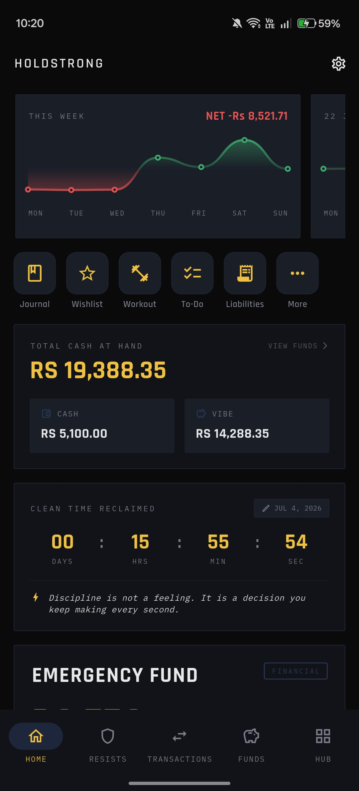
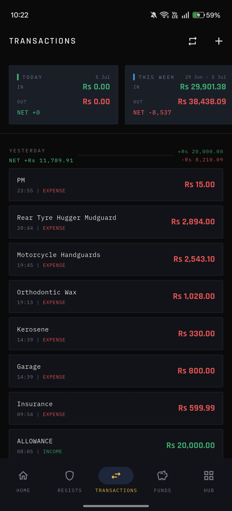

# HoldStrong

> **Note:** I built this application for myself and use it every day to get my shit together. I'm just sharing it here. Feel free to suggest features or improvements, but there are no guarantees that I will implement them.

HoldStrong is a personal command center built with Flutter. Originally designed as a discipline tracker, it has evolved into a comprehensive life-management dashboard. It helps you track finances, manage custom timers, log workouts, and keep your daily life organized—all in one fast, offline-first application.

## Screenshots

| Dashboard & Recalibration Engine | Discipline & Financial Tracking |
| :---: | :---: |
|  |  |

## Features

- **Financial Hub**: A robust transaction manager for logging income, expenses, and liabilities. Features custom categories, rich filtering, and detailed analysis reports to understand your spending habits.
- **Funds Management**: Create custom fund accounts (e.g., Cash, Bank, Wallet) with opening balances and see live calculations based on your transactions.
- **Workout & Weight Log**: Build a visual gym habit by logging your daily workouts, monitoring active streaks, and tracking weight history with trend indicators.
- **Custom Timers**: Create and manage highly configurable custom timers (like Recalibration or Pomodoro sessions) right from your dashboard.
- **Discipline Tracking (Resists)**: Log cravings you resist, tracking money saved and calories avoided towards specific financial or fitness goals.
- **Central Hub**: A command center for secondary productivity tools, including:
  - **Journaling**: Document your thoughts and daily reflections with auto-saving.
  - **Wishlist**: Track items you want to purchase along with estimated costs.
  - **To-Do List**: Manage daily tasks and deadlines with overdue highlighting.
- **Data Persistence**: Lightning-fast, entirely offline local data storage powered by Isar Database, complete with backup and restore functionality.

## Technology Stack

- **Framework**: Flutter
- **State Management**: Riverpod
- **Routing**: GoRouter
- **Local Database**: Isar

## Getting Started

### Prerequisites

- Flutter SDK (>=3.11.0 <4.0.0)
- Dart SDK

### Installation

1. Clone the repository
2. Install dependencies:
   ```bash
   flutter pub get
   ```
3. Generate necessary code files (Isar schemas and Riverpod providers):
   ```bash
   dart run build_runner build --delete-conflicting-outputs
   ```
4. Run the application:
   ```bash
   flutter run
   ```

## Build

To build a release APK for Android:

```bash
flutter build apk --release
```

To build an App Bundle (AAB) for the Google Play Store:

```bash
flutter build appbundle --release
```
